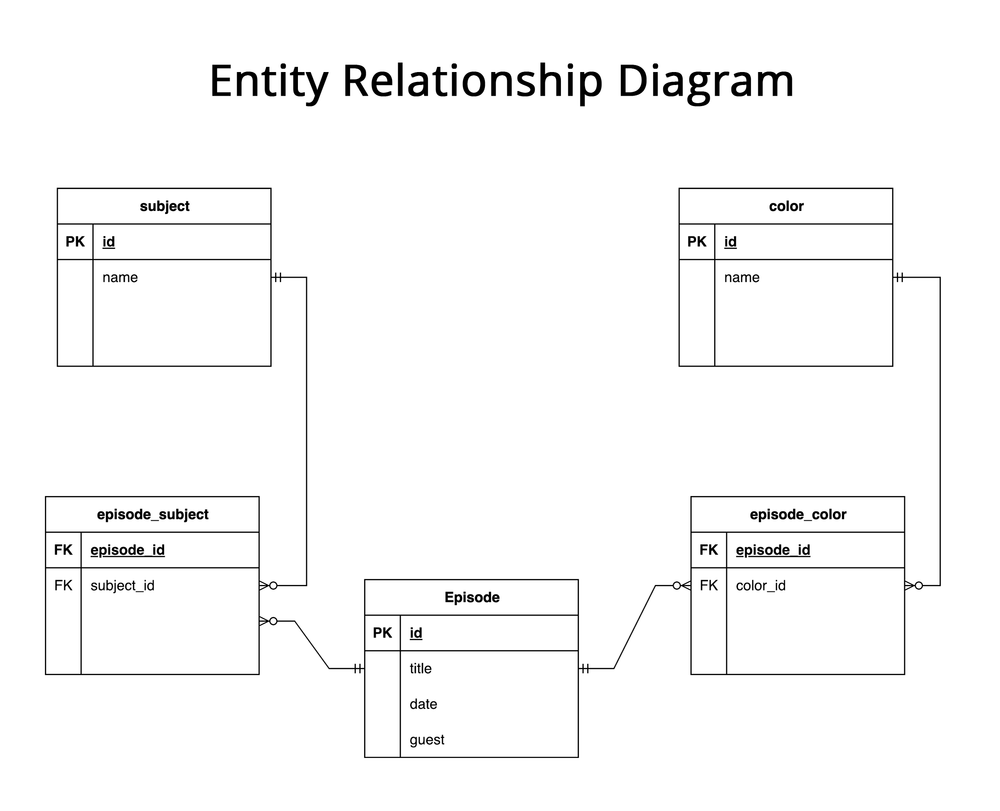

# The Joy of Painting API

> *"We don't make mistakes, just happy little accidents."* - Bob Ross

A REST API project developed as part of my software engineering education. This API provides access to Bob Ross's "The Joy of Painting" episode data with filtering capabilities, demonstrating skills in backend development, database design, and API architecture.




## About the Developer

I'm **Tristian Davis**, a Software Engineer transitioning into a new field. This project was developed as part of my software engineering education, where I learned backend development, database design, and API architecture.

**Connect with me:**
- [LinkedIn](https://www.linkedin.com/in/tristiandavis/) - Let's connect professionally
- [Email](mailto:tristiangdavis@gmail.com) - Get in touch directly

## Project Overview

This project was assigned as part of my software engineering coursework to demonstrate proficiency in building REST APIs, working with databases, and processing data. The assignment required creating an API that could filter and retrieve information from a dataset, and I was given Bob Ross's "The Joy of Painting" data to work with. A key learning component was building an ETL (Extract, Transform, Load) pipeline to process CSV datasets and populate the database, which provided a hands on experience with data processing and database management.

**Learning Objectives Achieved:**
- **Database Design**: Created a normalized schema with proper relationships between episodes, subjects, and colors
- **ETL Development**: Built data processing scripts to handle CSV datasets and populate the database
- **API Architecture**: Implemented RESTful endpoints with filtering capabilities
- **Backend Development**: Gained experience with Node.js, Express, and PostgreSQL

**Technical Challenges Encountered:**
1. **Data Normalization**: Learning to design database schemas that efficiently handle complex relationships
2. **ETL Processing**: Working with inconsistent CSV data and building reliable parsing scripts
3. **Query Optimization**: Writing efficient SQL queries for filtering and data retrieval
4. **API Design**: Understanding REST principles and implementing proper error handling

## Architecture & Database Design

The API is built with a clean, scalable architecture:

```
┌─────────────────┐    ┌─────────────────┐    ┌─────────────────┐
│   Express.js    │    │   PostgreSQL    │    │   CSV Datasets  │
│   REST Server   │◄──►│   Database      │◄──►│   ETL Pipeline  │
└─────────────────┘    └─────────────────┘    └─────────────────┘
```

### Database Schema

The database uses a normalized structure with five main tables and junction tables for many-to-many relationships.

**Core Tables:**
- **`episodes`** - Episode metadata (ID, title, air date)
- **`subjects`** - Painting subjects (trees, mountains, cabins, etc.)
- **`colors`** - Paint colors used in episodes
- **`episode_subjects`** - Junction table linking episodes to subjects
- **`episode_colors`** - Junction table linking episodes to colors

## Features Implemented

### Core Functionality
- **RESTful API** with Express.js backend
- **Data Filtering** by month, subject, and color
- **PostgreSQL Database** with normalized schema
- **ETL Pipeline** for CSV data processing
- **CORS Support** for cross-origin requests
- **Error Handling** with appropriate HTTP status codes
- **Query Logging** for debugging and monitoring

### Filtering Capabilities
- **Month Filtering**: Filter episodes by air date month (1-12 or month names)
- **Subject Filtering**: Find episodes featuring specific subjects (trees, mountains, etc.)
- **Color Filtering**: Discover episodes using particular paint colors
- **Combined Filters**: Mix and match filters for precise results

### Data Endpoints
- `GET /episodes` - Retrieve episodes with optional filtering
- `GET /subjects` - Get all available painting subjects
- `GET /colors` - Get all paint colors used in the show

## Getting Started

### Prerequisites
- Node.js (v14 or higher)
- PostgreSQL (v12 or higher)
- npm or yarn package manager

### Installation

1. **Clone the repository**
   ```bash
   git clone https://github.com/TebariousBag/atlas-the-joy-of-painting-api.git
   cd atlas-the-joy-of-painting-api
   ```

2. **Install dependencies**
   ```bash
   npm install
   ```

3. **Set up the database**
   ```bash
   # Connect to PostgreSQL
   psql -U your_username
   
   # Create the database
   CREATE DATABASE bobbie_ross;
   
   # Connect to the new database
   \c bobbie_ross
   
   # Run the schema
   psql -U your_username -d bobbie_ross -f bobbie_ross_schema.sql
   ```

4. **Configure database connection**
   Update `database/db.js` with your PostgreSQL credentials:
   ```javascript
   const client = new Client({
     user: 'your_username',
     host: 'localhost',
     database: 'bobbie_ross',
     password: 'your_password',
     port: 5432,
   });
   ```

5. **Import the data**
   ```bash
   # Run the ETL pipeline
   node parse_data1.js
   node parse_data2.js
   node parse_data3.js
   ```

6. **Start the server**
   ```bash
   node server.js
   ```

The API will be available at `http://localhost:3432`

## Testing the API

### Basic Endpoints
```bash
# Health check
curl "http://localhost:3432/"

# Get all episodes
curl "http://localhost:3432/episodes"

# Get all subjects
curl "http://localhost:3432/subjects"

# Get all colors
curl "http://localhost:3432/colors"
```

### Advanced Filtering
```bash
# Filter by month (January)
curl "http://localhost:3432/episodes?month=1"

# Filter by subject (Trees)
curl "http://localhost:3432/episodes?subjects=TREES"

# Filter by color (Alizarin Crimson)
curl "http://localhost:3432/episodes?colors=Alizarin%20Crimson"

# Complex filtering (episodes in January featuring trees with Alizarin Crimson)
curl "http://localhost:3432/episodes?month=1&subjects=TREES&colors=Alizarin%20Crimson"
```

## Technology Stack

- **Backend**: Node.js, Express.js
- **Database**: PostgreSQL
- **Data Processing**: CSV parsing, custom ETL pipeline
- **API Design**: RESTful architecture
- **Development**: Modern JavaScript (ES6+)

## Performance & Scalability

- **Database Indexing**: Optimized queries with proper indexing
- **Connection Pooling**: Efficient database connection management
- **Error Handling**: Comprehensive error handling and logging
- **CORS Support**: Cross-origin request handling for frontend integration

## Potential Future Enhancements

### Additional Features That Could Be Added
- **Authentication System** for API access control
- **Rate Limiting** to prevent abuse
- **Caching Layer** for improved performance
- **GraphQL Support** for flexible data querying
- **Real-time Updates** with WebSocket support
- **Analytics Dashboard** for usage insights

### API Improvements
- **Pagination** for large result sets
- **Advanced Search** with full-text search capabilities
- **Filter Combinations** with AND/OR logic
- **Response Formatting** options (JSON, XML, CSV)

*"Every day is a good day when you paint."* - Bob Ross

